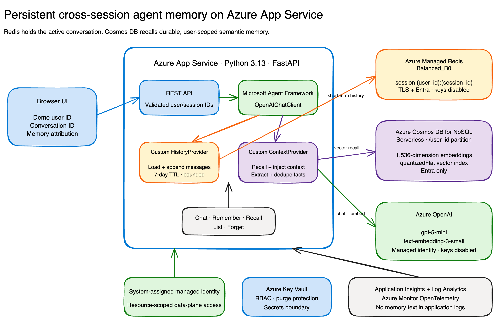

# Persistent agent memory on Azure App Service

A complete Python sample for agents that remember the current conversation **and** durable,
user-scoped facts across new conversations.

[Architecture source](docs/architecture/architecture.excalidraw) ·



## What this sample demonstrates

- **Microsoft Agent Framework** with custom `HistoryProvider` and `ContextProvider`
  implementations.
- **Short-term memory** in Azure Managed Redis, keyed by user and conversation with a
  configurable seven-day TTL.
- **Durable semantic memory** in Azure Cosmos DB for NoSQL with a 1,536-dimension
  `quantizedFlat` vector index.
- **Azure OpenAI** `gpt-5-mini` for agent responses and `text-embedding-3-small` for recall.
- **Passwordless Azure access** from App Service through its system-assigned managed identity.
- **Explicit memory controls** for remember, recall, list, and forget, plus recalled-memory
  attribution on chat responses.
- **A deterministic fake mode** that exercises the complete browser and API experience without an
  Azure subscription.
- **Repeatable deployment** with Azure Developer CLI and Bicep.

> [!IMPORTANT]
> The browser identity is intentionally a demo. It generates `user_id` and `session_id` values in
> `localStorage`. Production applications must authenticate users and derive memory scope from
> trusted identity claims; never trust a browser-supplied user ID as authorization.

## Architecture

| Horizon | Azure service | Agent Framework integration | Scope |
| --- | --- | --- | --- |
| Active conversation | Azure Managed Redis | Custom `RedisHistoryProvider` | `session:{user_id}:{session_id}` |
| Durable user memory | Azure Cosmos DB for NoSQL | Custom `CosmosContextProvider` | Partition key `/user_id` |

The request flow is:

1. Validate and bound the demo user ID, conversation ID, message, and recall limits.
2. Load the most recent conversation messages from Redis.
3. Embed the current input and run a partition-scoped vector query in Cosmos DB.
4. Inject relevant durable memories through the Agent Framework context pipeline.
5. Run `gpt-5-mini` and return the response with memory attribution.
6. Append input and output messages to Redis and refresh the TTL.
7. Conservatively extract explicit durable facts, embed them, deduplicate by content hash, and
   upsert them to the user's Cosmos DB partition.

The sample keeps one App Service instance so an in-process conversation lock can serialize requests
for the same session. See [Production hardening](#production-hardening) before scaling out.

## Repository layout

```text
app/
  agent.py           Agent construction and request orchestration
  providers.py       Agent Framework HistoryProvider and ContextProvider
  stores.py          Redis, Cosmos DB, and deterministic in-memory stores
  embeddings.py      Azure OpenAI and deterministic embeddings
  main.py            FastAPI routes
  static/            Interactive browser UI
infra/               Bicep for App Service and supporting Azure resources
scripts/smoke_test.py
tests/
docs/architecture/
blog/
```

## Prerequisites

- [Python 3.13](https://www.python.org/downloads/)
- [uv](https://docs.astral.sh/uv/) for local development
- [Azure CLI](https://learn.microsoft.com/cli/azure/install-azure-cli)
- [Azure Developer CLI](https://learn.microsoft.com/azure/developer/azure-developer-cli/install-azd)
- An Azure subscription with access to App Service Premium v4, Azure Managed Redis, Cosmos DB, and
  Azure OpenAI models

## Run locally without Azure

Fake mode is the default. It uses the real Agent Framework provider pipeline with deterministic
in-memory stores and a deterministic chat client.

```bash
uv sync --python 3.13 --all-groups
uv run uvicorn app.main:app --reload
```

Open <http://127.0.0.1:8000>. Try this workflow:

1. Enter `My favorite launch color is teal.`
2. Select **New conversation**.
3. Ask `What is my favorite launch color?`
4. Inspect the recalled-memory attribution and use **Forget** to remove the memory.

## Run the quality suite

```bash
uv run ruff format --check app tests scripts
uv run ruff check app tests scripts
uv run mypy app tests scripts
uv run pytest -q
```

The tests cover provider lifecycle behavior, user isolation, deduplication, TTL, bounded history and
recall, API validation, failure propagation, and the complete fake-mode memory lifecycle.

## Deploy to Azure

The included Bicep deploys:

- App Service Linux `P0v4`, Python 3.13, one always-on instance
- Azure Managed Redis `Balanced_B0`
- Cosmos DB for NoSQL serverless account and vector-enabled container
- Azure OpenAI account with the chat and embedding deployments
- Key Vault with RBAC, soft delete, and purge protection
- Workspace-based Application Insights and Log Analytics

Authenticate and create an azd environment:

```bash
az login
azd auth login
azd env new agent-memory-<unique-suffix> --no-prompt
azd env set AZURE_SUBSCRIPTION_ID <subscription-id>
azd env set AZURE_LOCATION <supported-region>
```

Then provision and deploy with one command:

```bash
azd up --no-prompt
```

Azure Managed Redis availability can vary by subscription and region. This deployed sample uses
`eastus2` after the service preflight rejected `eastus`. Use the first region that supports all
resources and model quota for your subscription.

After deployment, run the real-service smoke test with the endpoint reported by `azd show`:

```bash
uv run python scripts/smoke_test.py https://<app-name>.azurewebsites.net
```

## Memory model

Durable memory documents contain:

```json
{
  "id": "stable user-scoped content identifier",
  "user_id": "demo-user-id",
  "text": "My favorite launch color is teal",
  "category": "preference",
  "source_turn": "turn identifier",
  "created_at": "ISO-8601 timestamp",
  "updated_at": "ISO-8601 timestamp",
  "embedding": [0.01, -0.02],
  "content_hash": "sha256"
}
```

The actual embedding contains 1,536 values. The document ID includes the user scope and normalized
content hash, so identical text from different users never collides. Recall always supplies the
Cosmos DB partition key and binds `user_id` in the query.

Automatic extraction is deliberately conservative. The sample stores explicit phrases such as
`Remember that ...`, direct `My ... is ...` facts, and a small set of first-person statements. This
reduces surprising persistence; production applications should define a consent and retention
policy before widening extraction.

## API

| Operation | Endpoint | Purpose |
| --- | --- | --- |
| Health | `GET /health` | Runtime status and active mode |
| Chat | `POST /api/chat` | Run the agent with session history and durable recall |
| Remember | `POST /api/memories/remember` | Explicitly create or refresh a memory |
| Recall | `POST /api/memories/recall` | Run bounded semantic recall |
| List | `GET /api/users/{user_id}/memories` | List the user's durable memories |
| Forget | `DELETE /api/users/{user_id}/memories/{memory_id}` | Delete one user-scoped memory |

A chat response includes the answer, IDs, recalled memory metadata, and any facts stored during that
turn. Embeddings and content hashes are never returned to the browser.

## Security

- App Service uses `ManagedIdentityCredential`; local real-Azure development uses
  `AzureCliCredential`.
- Azure OpenAI and Cosmos DB local/key authentication are disabled.
- Azure Managed Redis requires TLS and Entra authentication; access keys are disabled.
- The App Service identity has resource-scoped data-plane access only:
  `Cognitive Services OpenAI User`, Cosmos DB built-in data contributor, Key Vault Secrets User,
  and a Redis database access-policy assignment.
- Key Vault is the boundary for any secrets added by future extensions. The current application is
  passwordless and stores no runtime secrets there.
- Dependency failures return explicit 503 responses rather than success-shaped fallbacks.
- A bounded, instance-wide API throttle limits accidental or automated cost amplification in the
  public demo.
- Logs contain operational metadata, not message or memory text.

Public network endpoints remain enabled for this demonstration. Authentication and local-key
controls protect the data plane, but network isolation is still recommended for production.

## Cost notes

The principal fixed cost is the always-on App Service Premium v4 plan and Azure Managed Redis.
Cosmos DB serverless, Application Insights, Log Analytics, and Azure OpenAI are usage-based.
Model deployments reserve quota, not a fixed hourly model charge, but requests consume billable
tokens. Prices differ by agreement and region; review the
[Azure pricing calculator](https://azure.microsoft.com/pricing/calculator/) before deployment.

## Production hardening

Before adapting this sample for production:

- Replace demo IDs with authenticated tenant and user claims.
- Add authorization checks for every memory operation and an auditable consent experience.
- Use private endpoints, VNet integration, restrictive firewalls, and private DNS.
- Replace the in-process conversation lock with a distributed lock before scaling App Service
  beyond one instance.
- Define memory retention, export, legal hold, and deletion policies.
- Put authentication, per-identity quotas, and a distributed rate limiter or gateway in front of
  the sample; the included global in-process throttle is only a demo safeguard.
- Consider a custom Redis access policy when the feature is appropriate for your environment; the
  current generally available Azure Managed Redis assignment uses its built-in `default` policy.
- Add regional resilience and backup/restore based on your recovery objectives.
- Tune vector index choice and retrieval thresholds against representative evaluation data.
- Avoid logging prompts, model responses, recalled text, tokens, or identity claims.

## Clean up

Cleanup permanently deletes the resource group and all memory:

```bash
azd down --force --purge
```

Key Vault purge protection can retain the deleted vault for its configured retention period.

## Official documentation

- [Microsoft Agent Framework memory](https://learn.microsoft.com/agent-framework/get-started/memory)
- [Agent Framework context providers](https://learn.microsoft.com/agent-framework/agents/conversations/context-providers)
- [Configure Python on App Service](https://learn.microsoft.com/azure/app-service/configure-language-python)
- [Azure Managed Redis with Microsoft Entra ID](https://learn.microsoft.com/azure/redis/entra-for-authentication)
- [Cosmos DB vector indexing and queries](https://learn.microsoft.com/azure/cosmos-db/how-to-python-vector-index-query)
- [Azure OpenAI without keys](https://learn.microsoft.com/azure/developer/ai/keyless-connections)
- [Managed identities for Azure resources](https://learn.microsoft.com/entra/identity/managed-identities-azure-resources/overview)

## License

This project is licensed under the [MIT License](LICENSE).
